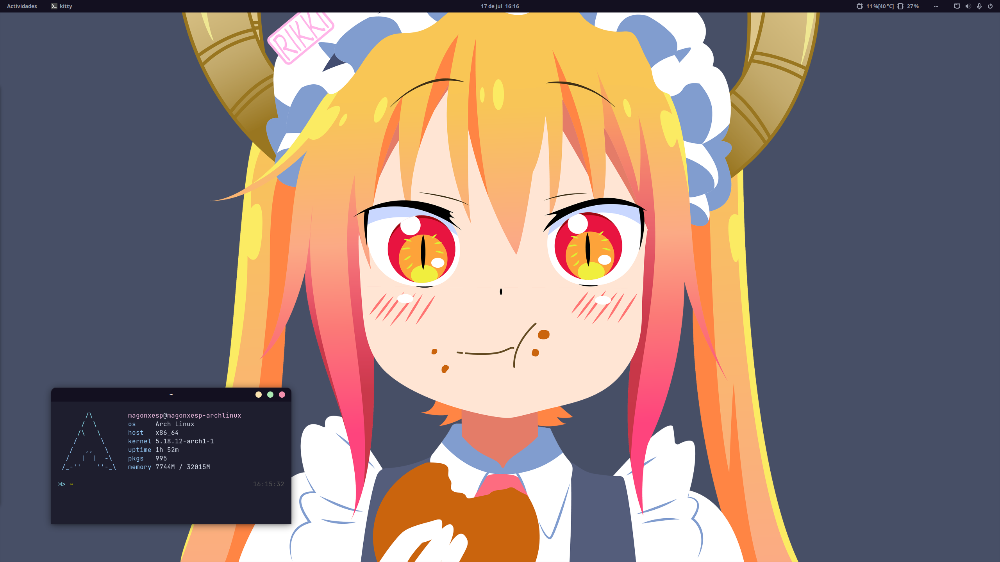

# Configuración de GNOME

Configuración de GNOME 42 o posterior.



## Dependencias

* [GNOME Tweak Tools](https://archlinux.org/packages/extra/any/gnome-tweaks/)
* [Flatpak](https://flatpak.org/)
* [GNOME Extensions](https://flathub.org/apps/details/org.gnome.Extensions) (flatpak)
* [gnome-browser-connector](https://aur.archlinux.org/packages/gnome-browser-connector)

## Extensiones

Las extensiones se pueden instalar y activar desde https://extensions.gnome.org/

* [User Themes](https://extensions.gnome.org/extension/19/user-themes/)
* [Tray Icons: Reloaded](https://extensions.gnome.org/extension/2890/tray-icons-reloaded/)
* [Resource Monitor](https://extensions.gnome.org/extension/1634/resource-monitor/)

## Temas y fuentes

* Tema: [Catppuccin-blue](https://github.com/catppuccin/gtk)
* Iconos: [EPapirus-Dark](https://github.com/PapirusDevelopmentTeam/papirus-icon-theme)
* Cursor: Adwaita (default)
* Fuente: [Noto Sans Regular](https://fonts.google.com/noto/specimen/Noto+Sans)
* Fuente Monoespacio: [JetBrainsMono Nerd Font Regular](https://github.com/ryanoasis/nerd-fonts/blob/master/patched-fonts/JetBrainsMono/Ligatures/Regular/complete/JetBrains%20Mono%20Regular%20Nerd%20Font%20Complete%20Mono.ttf)

### Flatpak

Aplicar el tema de GTK en las aplicaciones de flatpak

```sh
$ sudo flatpak override --filesystem=$HOME/.themes
$ sudo flatpak override --env=GTK_THEME=Catppuccin-blue
```
